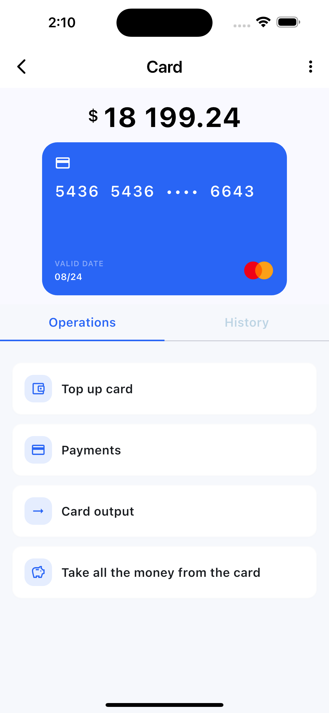

# Flutter Assignment

* Implemented both screens.
* UI colors, logos, and some icons may be slightly different.
* To navigate to the second screen, press the floating action button in the middle of the bottom navigation bar.

## Screenshots

## Screenshots

